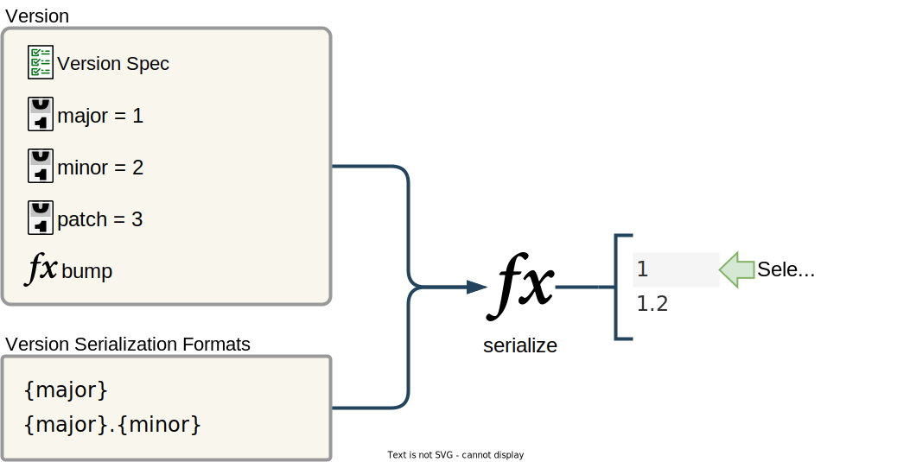

# The mental model used by Bump My Version

## Overview

There are four main concepts in Bump My Version:

1. Configuration
2. Version handling
3. File changing
4. Source control management interface

## Configuration

The predecessor to Bump My Version, [bumpversion](https://github.com/peritus/bumpversion), was designed to have the configuration file optional. All configuration values could be specified on the command line. This only worked in the simplest of version schemes.

While Bump My Version can do many things without a configuration file, it is designed to have a configuration file. The configuration file is required to specify the version scheme. The configuration file also specifies the files to change and how to change them.

## Version handling

Bump My Version abstracts the version handling into a few concepts:

A **version spec** defines the rules for incrementing a version.

A **version component spec** defines how a single part of a _version spec,_ such as `major`, `minor`, or `patch`, works. It defines the types of values, how to increment the component, and how to reset it.

A **version parser** is a regular expression used in several ways. Its named capture groups define the possible components in a version spec and the order in which they appear. It also parses a version string into version component names and their values.

A **version** is the concrete representation of a _version spec._ It is a mapping of version component names to _version components._ 

A **version component** is the concrete representation of a _version component spec._ It is a _version component spec_ with a specific value.

A **version serialization format** is a list of format strings used to serialize a _version_ into a string.

### How a version spec is generated

<figure markdown="span" style="width: 50%; float: right;padding-left: .75rem">
    
    <figcaption>How a configuration file is used to generate a version spec.</figcaption>
</figure>

The most important part of the configuration file is the _version parser._ It defines the structure of the _version spec._ 

If the configuration file contains a _version component spec_ that matches a named capture group in the _version parser,_ then that _version component spec_ is used in the _version spec._ The yellow and green named capture groups in the diagram demonstrate this.

If the configuration file does not contain a _version component spec_ that matches a named capture group in the _version parser,_ then a default _version component spec_ is used. The blue named capture group in the diagram demonstrates this.

The _component dependency_ graph determines the order in which the _version components_ are incremented and reset. For example, in the diagram, the patch component depends on the minor component, which depends on the `major` component. Therefore, when the `major` component is incremented, the `minor` component is reset, which cascades to the `patch` component. 

### How a version is generated

<figure markdown="span" style="width: 50%; float: right;padding-left: .75rem">
    
    <figcaption>How a version spec is used to generate a version.</figcaption>
</figure>

The _version spec_ has a `create_version` method that takes a mapping of version component names to values. 

Each _version component spec_ has a `create_component` method that takes a value. The `create_version` method calls the `create_component` method for each _version component spec_ in the _version spec_ with the value from the mapping.

The `create_component` assembles its version spec_ with the _version components_ to create a _version._

### How a version is serialized

**Optional value rule.** _Version component specs_ can define an optional value. For example, numeric components have `0` as an optional value. Optional values may be omitted from the serialization as long as all dependent components also have optional values.

**Required value rule.** _Version component specs_ is required if its value or the value of any of its dependent components is not optional.

A valid serialization contains all the required components in the version spec based on the _required value rule._

An invalid serialization does not contain all the required components in the version spec based on the _required value rule._

The optimal serialization is the valid serialization that uses the fewest components.

The `serialize` method of the _version spec_ returns either the optimal serialization or the first invalid serialization.

### Version serialization examples

::: grid wide-gap

    ::: card-container depth-0
        ::: card-media
            

        ::: card-content
            No optional values
            {.card-content-title}

            In this example, the `major` component is `1`,  the `minor` component is `2`, and `patch` component is `3`. Since none of the values are optional (`0`), only one serialization format is valid. This one valid format is the optimal format.

    ::: card-container depth-0
        ::: card-media
            
            
        ::: card-content
        
            One optional value
            {.card-content-title}
            
            A version with values major=1, minor=2, and patch=0 has two valid serializations. The optimal serialization is the one that uses the fewest components. `1.2` in this example.

    ::: card-container depth-0
        ::: card-media
            

        ::: card-content
            Two optional values
            {.card-content-title}

            A version with values major=1, minor=0, and patch=0 has three valid serializations. The optimal serialization is the one that uses the fewest components. `1` in this example.

    ::: card-container depth-0
        ::: card-media
            

        ::: card-content
            No valid serialization options
            {.card-content-title}

            A version with values major=1, minor=2, and patch=3 has no valid serializations in this example. The `serialize` method returns the first invalid serialization.
